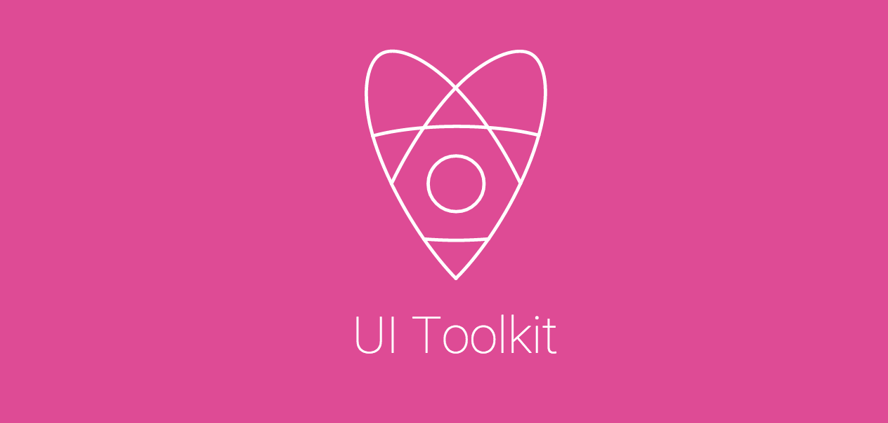

<header style="background: rgb(222,75,149);padding:2em;text-align:center">
  
</header>

##### Under Active Development

Requirements:
---

* [Node.js v10+](http://nodejs.org/) ( For Application Development )

Install:
---

To install `ui-toolkit` locally for development:

```bash
git clone git@github.com:holidayextras/ui-toolkit.git
cd ui-toolkit
npm install
```

UI Toolkit Usage
---

All the available UI Toolkit Components are to be listed in the `src/ui-toolkit.js` so they can be accessed via:

```jsx
var UIToolkit = require('ui-toolkit');

// Custom Components
<UIToolkit.Button />
<UIToolkit.Flag />

// Bootstrap Components
<UIToolkit.BootstrapAccordion />
<UIToolkit.BootstrapAffix />
<UIToolkit.BootstrapAffixMixin />
<UIToolkit.BootstrapAlert />
<UIToolkit.BootstrapBadge />
<UIToolkit.BootstrapBadge />
<UIToolkit.BootstrapBootstrapMixin />
<UIToolkit.BootstrapButton />
<UIToolkit.BootstrapButtonGroup />
<UIToolkit.BootstrapButtonToolbar />
<UIToolkit.BootstrapCarousel />
<UIToolkit.BootstrapCarouselItem />
<UIToolkit.BootstrapCol />
<UIToolkit.BootstrapCollapsableMixin />
<UIToolkit.BootstrapDropdownButton />
<UIToolkit.BootstrapDropdownMenu />
<UIToolkit.BootstrapDropdownStateMixin />
<UIToolkit.BootstrapFadeMixin />
<UIToolkit.BootstrapGlyphicon />
<UIToolkit.BootstrapGrid />
<UIToolkit.BootstrapInput />
<UIToolkit.BootstrapInterpolate />
<UIToolkit.BootstrapJumbotron />
<UIToolkit.BootstrapLabel />
<UIToolkit.BootstrapListGroup />
<UIToolkit.BootstrapListGroupItem />
<UIToolkit.BootstrapMenuItem />
<UIToolkit.BootstrapModal />
<UIToolkit.BootstrapModalTrigger />
<UIToolkit.BootstrapNav />
<UIToolkit.BootstrapNavbar />
<UIToolkit.BootstrapNavItem />
<UIToolkit.BootstrapOverlayMixin />
<UIToolkit.BootstrapOverlayTrigger />
<UIToolkit.BootstrapPageHeader />
<UIToolkit.BootstrapPageItem />
<UIToolkit.BootstrapPager />
<UIToolkit.BootstrapPanel />
<UIToolkit.BootstrapPanelGroup />
<UIToolkit.BootstrapPopover />
<UIToolkit.BootstrapProgressBar />
<UIToolkit.BootstrapRow />
<UIToolkit.BootstrapSplitButton />
<UIToolkit.BootstrapSubNav />
<UIToolkit.BootstrapTabbedArea />
<UIToolkit.BootstrapTable />
<UIToolkit.BootstrapTabPane />
<UIToolkit.BootstrapTooltip />
<UIToolkit.BootstrapWell />
```

If you would like to cherry pick which components to include in your project, you can use this method:

```jsx
var Button = require('ui-toolkit').Button;
<Button />

var BootstrapPanel = require('ui-toolkit').BootstrapPanel;
<BootstrapPanel />
```

Adding a new component
---
#### Adding a component to ui-toolkit
1. Firstly (if you haven't already), create a new component using our [yeoman generator](https://github.com/holidayextras/generator-ui-component)
2. Install your new component e.g. `npm install --save ui-component-foo`
3. Open `./src/ui-toolkit.js`
4. Add `UIToolkit.YourComponent = require('ui-component-foo');` to the `Custom Components` section

#### Updating the docs (todo, simplify this step)
1. In `./docs/examples/`, create a new jsx file that describes your component. e.g.
```jsx
// docs/examples/MyComponent.jsx
var myComponentInstance = (
  <UIToolkit.MyComponent foo="bar" />
);
React.render(myComponentInstance, mountNode);
```

2. In `./docs/src/Components.jsx`, add a new `<article>`, similar to the existing ones e.g.
```jsx
<article>
  <h3 id="my-component">My component</h3>
  <p>My component description</p>
  <CustomComponent codeText={fs.readFileSync(__dirname + '/../examples/MyComponent.jsx', 'utf8')} />
</article>
```

3. You should now be able to see your component when running `grunt docs`

UI Toolkit Themes
---
A collection of custom themes for UI Toolkit are listed below:

* [Holiday Extras](https://github.com/holidayextras/ui-brand-hx)
* [Essential Travel](https://github.com/holidayextras/ui-brand-et)

Component Documentation
---

You can view the React Components in your browser by generating and viewing the docs:

Run & watch the documentation in development:
```bash
grunt docs 
```

Building so you can upload to a remote docs server that does not require Node:
```bash
grunt docs-build
```

You will only need to upload the following static assets once generated:

+ assets/
+ vendor/
+ index.html

Grunt Terminal Commands:
---

#### THIS SECTION IS A WORK IN PROGRESS

You can use the following build commands via terminal:

#### Build for Distribution:

The following command will compile Less Styles into a CSS and Concat JS files for Distribution.

This is the most common command you will want to use and is required to view any changed you made in a browser or simulator.

```bash
grunt build
```

#### Create a Major Release:

The following will:

1. Increase the build's major number ( e.g. v __1__.2.3 => v __2__.0.0 )
2. Build & Package Distribution Files
3. Create Tag Branch & Perform a git commit
4. Generated Documentation will be merged into `gh-pages`

```bash
grunt release-major
```

#### Create a Minor Release:

The following will:

1. Increase the build's minor number ( e.g. v 1.__2__.3 => v 1.__3__.0 )
2. Build & Package Distribution Files
3. Create Tag Branch & Perform a git commit
4. Generated Documentation will be merged into `gh-pages`

```bash
grunt release-minor
```

#### Create a Release Patch:

The following will:

1. Increase the build's patch number ( e.g. v 1.2.__3__ => v 1.2.__4__ )
2. Build & Package Distribution Files
3. Create Tag Branch & Perform a git commit
4. Generated Documentation will be merged into `gh-pages`

```bash
grunt release-patch
```
